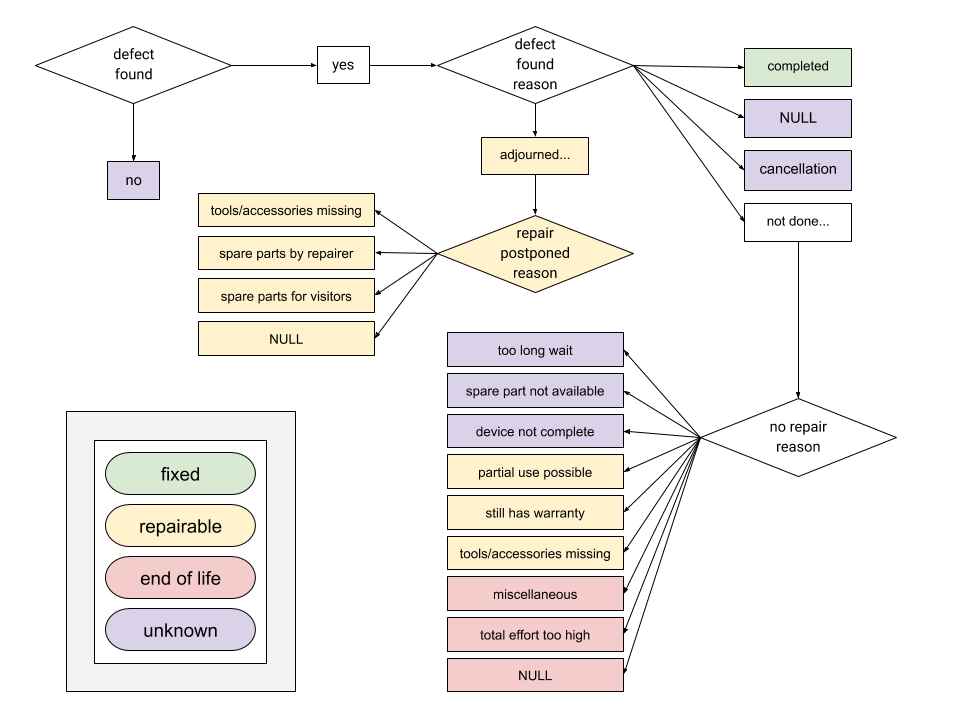

Document Information
===============================

Version
-------

***Number***: 0.2

***Description***: Initial version agreed by Open Repair Alliance
founding members.

***Published***: DD MM 2020.

License
-------

The Open Repair Data Standard and supporting documentation is licensed
under the `*Creative Commons Attribution-ShareAlike 4.0 (CC
BY-SA)* <https://creativecommons.org/licenses/by/4.0/>`__ license.

Changelog
---------

***V0.1*** - Initial version agreed by Open Repair Alliance founding
members, published on 14 November 2017

***V0.2*** - October 2020.

-  Recommended options for Repair Status.

-  Addition of Barriers to Repair fields.

Appendix A - Product category
-----------------------------

+-------------------------------------+
| Desktop computer                    |
+=====================================+
| Flat screen display                 |
+-------------------------------------+
| Laptop                              |
+-------------------------------------+
| Paper shredder                      |
+-------------------------------------+
| PC Accessory                        |
+-------------------------------------+
| Printer/scanner                     |
+-------------------------------------+
| Digital Compact Camera              |
+-------------------------------------+
| DSLR / Video Camera                 |
+-------------------------------------+
| Handheld entertainment device       |
+-------------------------------------+
| Headphones                          |
+-------------------------------------+
| Mobile                              |
+-------------------------------------+
| Tablet                              |
+-------------------------------------+
| Hi-Fi integrated                    |
+-------------------------------------+
| Hi-Fi separates                     |
+-------------------------------------+
| Musical instrument                  |
+-------------------------------------+
| Portable radio                      |
+-------------------------------------+
| Projector                           |
+-------------------------------------+
| TV and gaming-related accessories   |
+-------------------------------------+
| Aircon/Dehumidifier                 |
+-------------------------------------+
| Decorative or safety lights         |
+-------------------------------------+
| Fan                                 |
+-------------------------------------+
| Hair & Beauty item                  |
+-------------------------------------+
| Kettle                              |
+-------------------------------------+
| Lamp                                |
+-------------------------------------+
| Power tool                          |
+-------------------------------------+
| Small kitchen item                  |
+-------------------------------------+
| Toaster                             |
+-------------------------------------+
| Toy                                 |
+-------------------------------------+
| Vacuum                              |
+-------------------------------------+
| Misc                                |
+-------------------------------------+

Appendix B - Fault type
-----------------------

+--------------------------------+
| Boot                           |
+================================+
| Case/chassis                   |
+--------------------------------+
| Configuration                  |
+--------------------------------+
| Damage (internal)              |
+--------------------------------+
| Keyboard (integrated)          |
+--------------------------------+
| Media component (integrated)   |
+--------------------------------+
| Multiple                       |
+--------------------------------+
| Operating system               |
+--------------------------------+
| Optical drive (internal)       |
+--------------------------------+
| Other                          |
+--------------------------------+
| Overheating                    |
+--------------------------------+
| Performance                    |
+--------------------------------+
| Pointing device (integrated)   |
+--------------------------------+
| Ports/slots/connectors         |
+--------------------------------+
| Power/battery                  |
+--------------------------------+
| Screen (integrated)            |
+--------------------------------+
| Storage (internal)             |
+--------------------------------+
| System board                   |
+--------------------------------+
| Unknown                        |
+--------------------------------+
| Virus/malware                  |
+--------------------------------+

Appendix C - Fault category
---------------------------

+------------+
| Hardware   |
+============+
| Software   |
+------------+
| Unknown    |
+------------+

Appendix D - Solution type
--------------------------

+----------------+
| Cleaned        |
+================+
| Reinstalled    |
+----------------+
| Repaired       |
+----------------+
| Replaced       |
+----------------+
| Unknown/None   |
+----------------+
| Upgraded       |
+----------------+

Appendix E - Repair status
--------------------------

This appendix outlines the repair statuses currently collected by
partner organisations, and how they map to the ORDS values.

**ORDS**

+---------------+
| Fixed         |
+===============+
| Repairable    |
+---------------+
| End of life   |
+---------------+
| Unknown       |
+---------------+

**Restart Project**

Mapped from column “Repair Status”

+---------------------+-------------------+
| **Repair Status**   | **ORDS Status**   |
+=====================+===================+
| Fixed               | Fixed             |
+---------------------+-------------------+
| Repairable          | Repairable        |
+---------------------+-------------------+
| End of life         | End-of-life       |
+---------------------+-------------------+
| Unknown             | Unknown           |
+---------------------+-------------------+

**Repair Cafe Foundation**

Column: “Gerepareerd, ja, half/advies, nee” (“Repaired, yes, half /
advice, no”)

+-----------------------------+------------------------------+-------------------+
| **Dutch**                   | **English**                  | **ORDS Status**   |
+=============================+==============================+===================+
| Nee                         | No                           | Unknown           |
+-----------------------------+------------------------------+-------------------+
| Ja                          | Yes                          | Fixed             |
+-----------------------------+------------------------------+-------------------+
| Half en/of advies gegeven   | Half and / or advice given   | Repairable        |
+-----------------------------+------------------------------+-------------------+

**anstiftung**

Repair status is determined by evaluating the content of a number of
fields.

+---------------------------+---------------+---------------------+
| **defect\_found\_name**   |               |                     |
+===========================+===============+=====================+
| **German**                | **English**   | **Repair Status**   |
+---------------------------+---------------+---------------------+
| ja                        | yes           | (reason...)         |
+---------------------------+---------------+---------------------+
| nein                      | no            | Unknown             |
+---------------------------+---------------+---------------------+

+-------------------------------------------------+----------------------------------------------+---------------------+
| **defect\_found\_reason**                       |                                              |                     |
+=================================================+==============================================+=====================+
| **German**                                      | **English**                                  | **Repair Status**   |
+-------------------------------------------------+----------------------------------------------+---------------------+
| Abbruch: Gerät darf nicht mehr genutzt werden   | Cancellation: Device may no longer be used   | Unknown             |
+-------------------------------------------------+----------------------------------------------+---------------------+
| erfolgreich abgeschlossen                       | successfully completed                       | Fixed               |
+-------------------------------------------------+----------------------------------------------+---------------------+
| nicht erfolgt, weil...                          | not done, because ...                        | (reason…)           |
+-------------------------------------------------+----------------------------------------------+---------------------+
| vertagt, weil...                                | adjourned because ...                        | (reason...)         |
+-------------------------------------------------+----------------------------------------------+---------------------+
| NULL                                            | NULL                                         | Unknown             |
+-------------------------------------------------+----------------------------------------------+---------------------+

+----------------------------------------+------------------------------------+---------------------+
| **repair\_postponed\_reason**          |                                    |                     |
+========================================+====================================+=====================+
| **German**                             | **English**                        | **Repair Status**   |
+----------------------------------------+------------------------------------+---------------------+
| Ersatzteilbesorgung durch Besucher     | Spare parts for visitors           | Repairable          |
+----------------------------------------+------------------------------------+---------------------+
| Ersatzteilbesorgung durch Reparateur   | Spare parts by repairer            | Repairable          |
+----------------------------------------+------------------------------------+---------------------+
| Hilfsmittel oder Zubehör fehlt         | Tools or accessories are missing   | Repairable          |
+----------------------------------------+------------------------------------+---------------------+
| NULL                                   | NULL                               | Repairable          |
+----------------------------------------+------------------------------------+---------------------+

+----------------------------------+------------------------------------+---------------------+
| **no\_repair\_reason**           |                                    |                     |
+==================================+====================================+=====================+
| **German**                       | **English**                        | **Repair Status**   |
+----------------------------------+------------------------------------+---------------------+
| Ersatzteil nicht erhältlich      | Spare part not available           | Unknown             |
+----------------------------------+------------------------------------+---------------------+
| Gerät nicht komplett             | Device not complete                | Unknown             |
+----------------------------------+------------------------------------+---------------------+
| Gesamtaufwand zu hoch            | Total effort too high              | End of life         |
+----------------------------------+------------------------------------+---------------------+
| hat noch Garantie                | still has warranty                 | Repairable          |
+----------------------------------+------------------------------------+---------------------+
| Hilfsmittel oder Zubehör fehlt   | Tools or accessories are missing   | Repairable          |
+----------------------------------+------------------------------------+---------------------+
| Sonstiges                        | miscellaneous                      | End of life         |
+----------------------------------+------------------------------------+---------------------+
| Teilnutzung möglich              | Partial use possible               | Repairable          |
+----------------------------------+------------------------------------+---------------------+
| zu lange Wartezeit               | too long wait                      | Unknown             |
+----------------------------------+------------------------------------+---------------------+
| NULL                             | NULL                               | End of life         |
+----------------------------------+------------------------------------+---------------------+

+-------------------------------------------------+-----------------+---------------------+
| **device\_must\_not\_be\_used\_anymore \*\***   |                 |                     |
+=================================================+=================+=====================+
| **German**                                      | **English**     | **Repair Status**   |
+-------------------------------------------------+-----------------+---------------------+
| NULL                                            | NULL            |                     |
+-------------------------------------------------+-----------------+---------------------+
| *<not empty>*                                   | *<not empty>*   | End of life         |
+-------------------------------------------------+-----------------+---------------------+

\*\* The field \`device\_must\_not\_be\_used\_anymore\` was found to
have no values other than NULL. The assumption is that if a value was to
be found that the \`repair\_status\` would then be “End of life”.

|image0|

**Fixit Clinic**

Mapped from column “At this point: what's the disposition of this
item?”, containing a number of unique, white-space trimmed values. As
free-text can be entered, a number of these are not mappable
automatically - those that can are listed below.

+-------------------------------------------+---------------------+
| **Original**                              | **Repair Status**   |
+===========================================+=====================+
| Fixed (hooray!)                           | Fixed               |
+-------------------------------------------+---------------------+
| Repairable and I’m going to keep trying   | Repairable          |
+-------------------------------------------+---------------------+
| Unserviceable (End-of-Life)               | End of life         |
+-------------------------------------------+---------------------+
| End-of-Life                               | End of life         |
+-------------------------------------------+---------------------+
| Unknown                                   | Unknown             |
+-------------------------------------------+---------------------+

